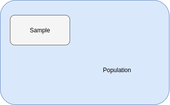

# `Chapter 1`
---
### `types` 
<dl>
    <dt>Descriptive</dt> 
    <dd>Giving short and valid description of large data.</dd>
    <dt>Inferential</dt>
    <dd>Using data to make conclusion.</dd>
 </dl>

 ---

# `Descriptive`
 - Central Tendency (Average)
    1. Mean (Arithmetic)
        ```python
        data = [1, 2, 3, 4, 5]
        mean = sum(data) / len(data)
        ```
    2. Median
        ```python
        data = [1, 2, 3, 4, 5]
        median = elementInCenter(Sorted(data))
        # 3
        # if count of data is even then
        data = [1, 2, 3, 4, 5, 6]
        subdata = twoElementsInCenter(Sorted(data))
        # [3, 4]
        median = arithmeticMean(subdata)
        # 3.5

        ```
    3. Mode
        ```python
        # mode will be helpful if there 
        # are repeating data points in dataset.
        # typically mode is most common point in a data set
        data = [1, 2, 2, 3, 4, 5]
        mode = 2

        data = [1, 2, 1, 2, 3, 4]
        mode = 1 and 2
        ```
> Example :
> data = [3, 3, 3, 3, 3, 100]
> mean = 19.166 
> median = 3 #adequate
> mode = 3 #adequate
---
### `Sample and Population`

 - `Population mean (𝛍):` Mean of whole dataset
    ```python
    𝛍 = sum(whole dataset) / len(whole dataset)
    ```
 - `Sample mean x̅ :` Mean of subset of dataset.
    ```python
    x̅ = sum(subset of whole dataset) / len(subset of whole dataset)
    ```
---
### Variance of Population (σ<sup>2</sup>)
```python
data = [1, 2, 4, ...]
# population mean
pmean = sum(data) / len(data)
variance = 0
# sum up
for i in data:
    variance += (i - pmean) ** 2
# calculate average
variance = variance / len(data)

``` 


